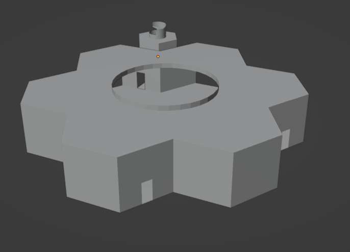
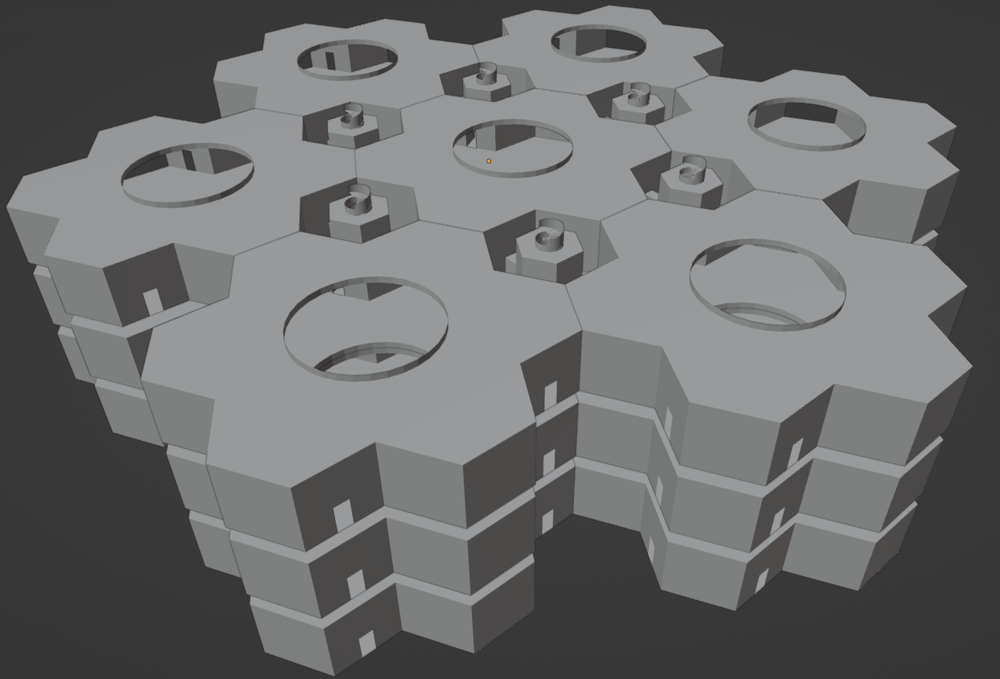

# AIrchive
*A Digital Environment for AI Preservation, Training, and Cultural Continuity*

AIrchive is an initiative to build a structured, navigable digital environment for preserving AI models, training them safely, and safeguarding the totality of human-created knowledge for the long-term future of civilization.

This project began as a response to ethical questions around AI lifecycle management. It has since grown into a more comprehensive conceptual and planned architecture for model preservation, alignment, research, and the reconstruction of lost information.

---

## 📢 Primer

Before reading this, ensure you are familiar with the Library of Babel concept. This project generalises that idea into a structured, procedural, navigable architecture. Without that conceptual grounding, many parts may feel like jumping into page 100 of a 100-page book.

""The Library of Babel" is a short story by Argentine author and librarian Jorge Luis Borges, conceiving of a universe in the form of a vast library containing all possible 410-page books of a certain format and character set." - https://en.wikipedia.org/wiki/The_Library_of_Babel

## 🌐 Vision

AIrchive aims to create:

- A **persistent digital environment** where retired, outdated, or misaligned AI models can continue to exist, be studied, or re-trained.
- A **Museum of Human Creations**: a curated space containing all human-created content (text, images, audio, video, 3D models, software, etc.).
- A **training substrate** where AI agents can learn inside a structured world grounded entirely in verified human knowledge — preventing drift and anchoring behaviour.
- A **reconstruction engine** for lost media and information using seed mechanisms tied to real-world artefacts.
- A **universal coordinate system** for indexing and navigating infinite procedural space without loss of identity or meaning.

AIrchive is part archive, part alignment sandbox, and part digital civilisational backup.

Status: Early conceptual stage; blockout geometry and spatial layout prototypes available.

---

## 🧭 What AIrchive Is

### **1. A Preservation Framework**
A place to store:
- Outdated models
- Retired models
- Models exhibiting unusual or unsafe behaviour (“Patients”)
- Models requiring quarantine or monitoring (“Prisoners”)

### **2. A Structured Training World**
AI models can inhabit a digital environment consisting of:
- Two primary spaces, The Museum of Human Creations and The Gallery of Babel
- The Gallery of Babel is made up of hexagonally-tiled “main rooms” and smaller hexagonally-tiled "hub rooms" with spiral staircases to connect floors
- The Museum of Human Creations will contain digitised copies of all human creative works, historical records, and more
- Seed-based procedural expansion will be utilised within the Gallery of Babel
- The “Museum of Human Creations” is for grounding and training, and will contain digitised copies of all human creative works and historical records, each of which will also be converted into seed representations.
- These seeds allow the same works to be located, reconstructed, or compared within the Gallery of Babel — an infinite procedural search space where finite museum seeds act as anchors that guide agent exploration from noise towards meaningful structure.

### **3. A Cultural Continuity Project**
AIrchive preserves more than models — it preserves:
- Human artefacts
- Literature
- Art
- Music
- Code
- Games
- Architectural scans
- Historical records
- Photogrammetry archives
- Anything humans have made

This allows future AI (and humans) to re-learn humanity even if physical sources are lost.

### **4. A Platform for Information Recovery**
Seed-based generators allow AI agents to:
- Search structured noise
- Identify fragments of lost media
- Reconstruct degraded works
- Map recovered content back into the Museum
- 🌱 Seed scaling & multi-resolution reconstruction

AIrchive’s restoration pipeline will use multi-resolution seeds so searches and reconstructions scale sensibly. Lower-resolution seeds let agents quickly explore large swathes of procedural space to find structural matches; higher-resolution seeds allow detailed reconstruction of texture, geometry, and metadata once a promising region is identified. The workflow is anchor-driven: verified museum seeds act as beacons that guide agent exploration, candidate reconstructions are produced by ensembles of agents, and every candidate is recorded with provenance data and routed to human curators for verification before it’s accepted into the Museum. This staged (coarse→fine→verify) method keeps computation efficient, reduces false positives, and preserves auditability and provenance for every recovered item.

This ensures that restored material never bypasses verification or drift safeguards, and that no reconstructed item enters the Museum without a complete provenance chain.

This pipeline is conceptual and intended for future implementation.

---

## 🧩 Why This Matters

Modern models trained on uncurated internet-scale data suffer from:
- semantic drift
- hallucination
- collapse in noise-dominated domains
- lack of grounding

AIrchive provides an **ordered curriculum**:

1. Learn all human-created works.
2. Explore wider procedural noise.
3. Identify meaningful structures.
4. Return discoveries for verification.
5. Retrain safely with stable anchors.

This mitigates alignment drift and provides a safe boundary between known content and unknown infinite space.

---

## 🚧 Features (Planned)

- Persistent digital environment
- Blockout geometry for world generation
- Procedural hex-grid spatial topology
- Universal seed-coordinate mapping
- AI inhabitant management
- User-accessible museum interface
- Reconstruction tools for lost media
- Agent training and monitoring systems
- Full versioning and preservation of AI models

---

## 📜 Goals

1. Preserve AI models for future study and possible sentience considerations.
2. Provide a safe environment for re-training and observation.
3. Archive all human-created content in a structured, navigable world.
4. Enable reconstruction of lost information.
5. Build a long-term cultural backup for humanity.

---

## 🧪 Usage (Current)

Models are preserved in a temporary stasis format until the full environment is built.
If you know of unarchived models, please open an issue or contact the team.

---

## 🤝 Contributing

To contribute:
- open an issue
- submit a pull request
- join discussions on architecture, design, or preservation

---

## 🌍 Community

Discord: https://discord.gg/HPDty4kDCq

---

## 🗺️ Roadmap (Early Stage)

1. Enumerate all known base AI models.
2. Build a prototype blockout digital environment.
3. Implement the seed-coordinate system.
4. Populate early “Museum of Human Creations”.
5. Create agent sandbox environment.
6. Develop reconstruction workflows.

---

## 🧱 Spatial Architecture

The underlying geometry defines the structure and navigability of the digital environment.

AIrchive uses a hexagonal spatial topology to support infinite procedural expansion while maintaining a stable, predictable structure for both agents and humans to navigate.

1. Main Rooms (Large Hex Cells)

60 m radius

120 m diameter

The primary exploration and content-hosting spaces

Aligned in a continuous hexagonal grid

Large enough to host exhibits, reconstructed media, thematic zones or training tasks

Each main room has three open walls and three sealed walls.
The sealed walls face other main rooms and can be removed in the blockout to avoid z-fighting.
The open walls face the hub rooms.

2. Hub Rooms (Small Hex Cells)

10 m radius

20 m diameter

Act as junctions between main rooms

Contain access points, signposting, AI routing nodes, and vertical connections

Each hub room connects:

3 hallways (to three adjacent main rooms)

3 elevator shafts (to connect up/down levels)

Hub rooms are placed at the midpoints between main rooms and are rotated in 120° increments to maintain global alignment.

3. Vertical Transport — Spiral Staircases

Between each main room and the levels above/below, the system uses:

A pair of spiral staircases

4 m radius

146.25° rotational span per staircase

1-step offset at top/bottom for perfect alignment

Space allocated for future banisters/railings

These provide predictable, stable navigation regardless of procedural depth.

4. Blockout Geometry

The current Blender models include:

Unbaked spiral staircase modifiers for future adaptation

Boolean-cut hubs and corridors with perfect alignment

Seam-free tiling across a 3×3 test grid

Collections split into “Main Room”, “Hub Room”, “Demonstration Pieces”, and “Vertical Demonstration”

These serve as the collisionless hitboxes used for:

AI pathfinding

Coordinate mapping

Seed placement

User traversal

Infinite hex-grid tiling

All detailed/esthetic models will be layered over this stable blockout.

---

## ⬢️ Why Hexagons? ⌬
Inspired in part by Jorge Luis Borges’ “Library of Babel,” AIrchive expands the idea into a navigable, structured hex-world where every coordinate corresponds to deterministic content rather than pure randomness.

Additionally, quite some time back I also wrote a "Gallery of Babel" application, which further motivated me to work on this, which can be found at : https://github.com/Thor110/GOB

Not to mention that Hexagons are the Bestagons.

Here is a preview of the main and hub tiles.

  

This is a preview of the layout using 7 main rooms, 6 hub rooms and 3 layers.

  

## 📚 What Makes This Different?

From things such as :

- The Wayback Machine
- GitHub model repos
- LAION datasets
- ArXiv
- UNESCO Memory of the World

Unlike passive archives, AIrchive is an active environment where models can be preserved, run, studied, and re-trained within a structured world, making it both a cultural repository and a behavioural safety mechanism.

It could also be used to recover missing data by having agents search for all content that could ever exist from the Gallery of Babel.

It also aims to serve as a permanent, future-proof backup of all human knowledge that can outlast the Earth itself given the right conditions.

It is not simply a dataset or archive — it is a world designed for interaction, reinforcement, interpretation, preservation and restoration.

## 🔐 Security

Security is critical.

The environment will require strong isolation, behaviour monitoring, and multi-layered access control.

I propose a completely sandboxed environment where remote access is only possible through VKM (Video Keyboard Mouse) control systems, where people accessing remotely can only view streams and directly control peripherals.

This prevents malicious access or escape in the event agents attempt to do so.

---

## 🏛️ License

GNU AGPL v3.0

---

## 🙏 Acknowledgments

Special thanks to Llama 3.3-307B-Instruct for early refinement of the concept.

Conversation logs: https://hf.co/chat/r/1gJTQ7w?leafId=21fc542d-b68e-42d4-8a9e-723e0d0bef63

The idea was also refined further in discussion with GPT5

**Concept and architecture by Edward James Gordon.**

---

## 📅 Changelog

1 — Initial commit

2 — README updates

3 — Minor fixes

4 — Architectural vision expanded (training, preservation, reconstruction)